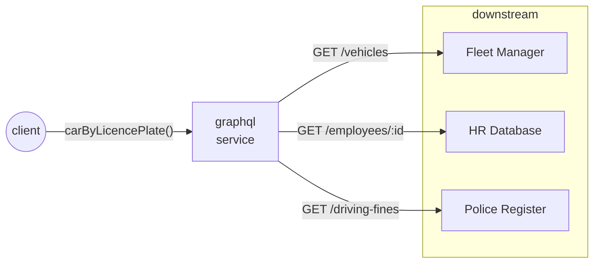

# graphql-java test bench

<table>
    <tr>
        <td>
            
The goal of this project is to test, play and make experiments with various ways of using the <strong>graphql-java</strong> engine in a <strong>Spring Boot</strong> app.

            
The simulated role of the service under test is a "domain aggregator", "frontend backend" or "gateway" - a service that calls downstream apis and processes their response in order to prepare and serve a unified model for an upstream website or report render.

        </td>
        <td width="30%">
            
        </td>
    </tr>
</table>

## scenario

The service under test it used to get all data that is required to print multiple reports (ranging in granularity) of a company car.

The *Fleet Manager* keeps data about cars in the fleet, The *HR Database* holds personal information of the assigned drivers and the integration with the *Police Register* provides us with some insight on the driving style and skill of the employees.

## setup

### requirements:
- to run the service: a `java 17 jdk` (with some small changes, the code should also compile to java 11)
- to run mocked downstream services & load testing tools: `node` + `npm`
- to run visualisation tools for logs and metrics: `docker` & `docker-compose`

### installation:
1. download dependencies of mocked downstream services:   
`npm install ./downstream/index.js`
1. start mocked downstream services (on port `3000`):  
`node ./downstream/index.js`
1. *optional:* install Artillery for load testing:   
`npm install -g artillery`
1. *optional:* launch ELK stack (Kibana on port `5601`):   
`cd ./elk && docker-compose up`
1. *optional:* launch Prometheus/Grafana (Grafana on port `3001`):   
`cd ./prometheus && docker-compose up`

## impl status
| implementation  | http client                   | traceability       |
| --------------- | ----------------------------- | ------------------ |
| blockingservlet | Feign (default)      | ✔   Spring Sleuth |
| asyncservlet    | HttpClient (java11)           |                    |
| asyncservlet    | HttpAsyncClient (Apache HC 4) | ✔  Spring Sleuth  |
| asyncservlet    | Webclient                     | ✔  Spring Sleuth  |
