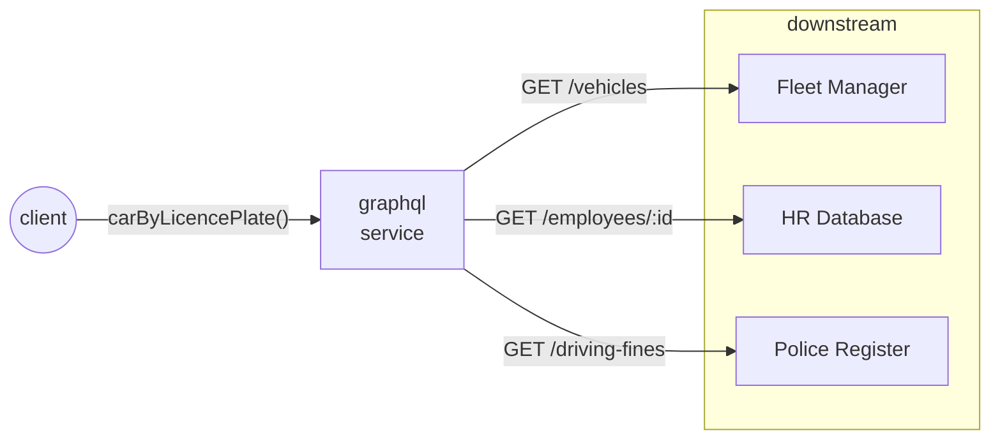

# graphql-java test bench

<table>
    <tr>
        <td>
            
The goal of this project is to test, play and make experiments with various ways of using the <strong>graphql-java</strong> engine in a <strong>Spring Boot</strong> app.

            
The simulated role of the service under test is a "domain aggregator", "frontend backend" or "gateway" - a service that calls downstream apis and processes their response in order to prepare and serve a unified model for an upstream website or report render.

        </td>
        <td width="30%">
            
        </td>
    </tr>
</table>

## scenario

The service under test it used to get all data that is required to print multiple reports (ranging in granularity) of a company car.

The *Fleet Manager* keeps data about cars in the fleet, The *HR Database* holds personal information of the assigned drivers and the integration with the *Police Register* provides us with some insight on the driving style and skill of the employees.

## structure

The servcie is structured as a multi module gradle project:

- `graphqltestbench:api` - Graphql schema and exposed POJOs
- `graphqltestbench:service` - the service or domain layer: business logic, dtos to map downstream services responses, etc. Things that can be shared in each of the  controller/application/graphql layer implementations.
- `graphqltestbench:blockingservlet`, `graphqltestbench:asyncservlet` - different implementations of the graphql layer. These modules depend on the others and have a main executable class.

Other directories conain configuration for tools that are useful for testing

- `./downstream/` - a small node app - mocked implementation of the downstream service.
- `./artillery/` - load testing scenarios
- `./elk/` - docker compose config for an elk stack, is set up to consume logs from the service under test and the downsteam mock.
- `./prometheus/` - docker compose config for Prometheus and Grafana. Automatically scrape metrics from the service under test. Can also visualise Artillery's test resuts. 

## setup

### requirements:
- to run the service: a `java 17 jdk` (with some small changes, the code should also compile to java 11)
- to run mocked downstream services & load testing tools: `node` + `npm`
- to run visualisation tools for logs and metrics: `docker` & `docker-compose`

### installation:
1. download dependencies of mocked downstream services:   
`npm install ./downstream/index.js`
1. start mocked downstream services (on port `3000`):  
`node ./downstream/index.js`
1. *optional:* install Artillery for load testing:   
`npm install -g artillery`
1. *optional:* launch ELK stack (Kibana on port `5601`):   
`cd ./elk && docker-compose up`
1. *optional:* launch Prometheus/Grafana (Grafana on port `3001`):   
`cd ./prometheus && docker-compose up`

## impl status
| implementation      | command                                                                               | http client                   | notes                                                                                                                                                                            |
| ------------------- | ------------------------------------------------------------------------------------- | ----------------------------- | -------------------------------------------------------------------------------------------------------------------------------------------------------------------------------- |
| blockingservlet     | `./gradlew :blockingservlet:bootRun`                                                  | Feign (default)               |                                                                                                                                                                                  |
| asyncservlet        | `./gradlew :asyncservlet:bootRun --args='--spring.profiles.active=java11-httpclient'` | HttpClient (java11)           | no tracing instrumentation                                                                                                                                                       |
| asyncservlet        | `./gradlew :asyncservlet:bootRun --args='--spring.profiles.active=apache-hc-client4'` | HttpAsyncClient (Apache HC 4) |                                                                                                                                                                                  |
| asyncservlet        | `./gradlew :asyncservlet:bootRun --args='--spring.profiles.active=webclient'`         | WebClient                     |                                                                                                                                                                                  |
| webflux             | `./gradlew :webflux:bootRun`                                                          | WebClient                     | graphql-java engine uses CompletableFutures internally and some translations to Mono/Flux are required. To avoid reinventing the (well build) wheel, Spring for Graphql is used. |
| plainoldrestservice | `./gradlew :plainoldrestservice:bootRun`                                              | Feign (default)               | plain, old, restful, thread-per-request spring boot web app that returns (almost) the same data.                                                                                 |